# 🎨 Security Architecture Diagrams (Mermaid.js)

> **Note:** These diagrams auto-render on GitHub/GitLab. In VSCode, install `Markdown Preview Mermaid Support` extension.

---

## 📐 1. SYSTEM ARCHITECTURE

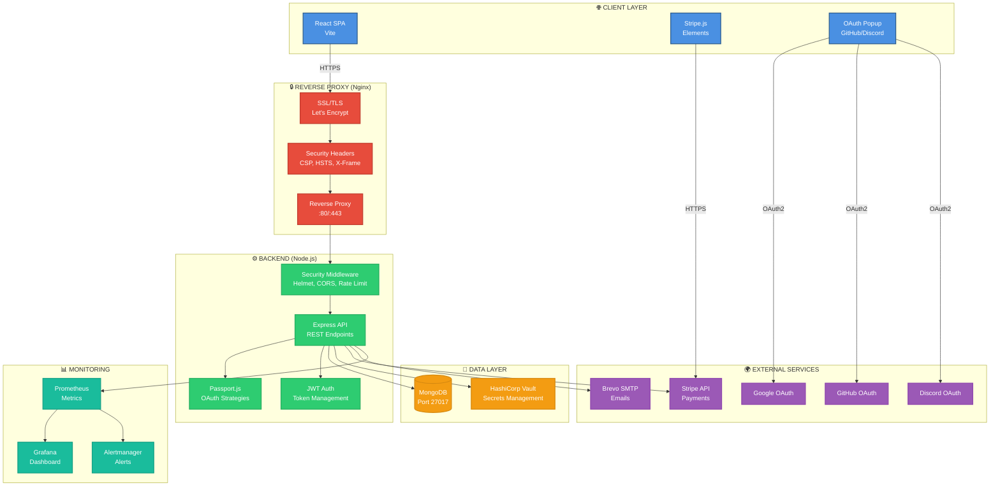
```mermaid
graph TB
    subgraph Client["🌐 CLIENT LAYER"]
        Browser[React SPA<br/>Vite]
        Stripe[Stripe.js<br/>Elements]
        OAuth[OAuth Popup<br/>GitHub/Discord]
    end

    subgraph Proxy["🔒 REVERSE PROXY (Nginx)"]
        SSL[SSL/TLS<br/>Let's Encrypt]
        Headers[Security Headers<br/>CSP, HSTS, X-Frame]
        RProxy[Reverse Proxy<br/>:80/:443]
    end

    subgraph Backend["⚙️ BACKEND (Node.js)"]
        Middleware[Security Middleware<br/>Helmet, CORS, Rate Limit]
        API[Express API<br/>REST Endpoints]
        Passport[Passport.js<br/>OAuth Strategies]
        JWT[JWT Auth<br/>Token Management]
    end

    subgraph Data["💾 DATA LAYER"]
        MongoDB[(MongoDB<br/>Port 27017)]
        Vault[HashiCorp Vault<br/>Secrets Management]
    end

    subgraph External["🌍 EXTERNAL SERVICES"]
        StripeAPI[Stripe API<br/>Payments]
        Google[Google OAuth]
        GitHub[GitHub OAuth]
        Discord[Discord OAuth]
        Email[Brevo SMTP<br/>Emails]
    end

    subgraph Monitor["📊 MONITORING"]
        Prom[Prometheus<br/>Metrics]
        Graf[Grafana<br/>Dashboard]
        Alert[Alertmanager<br/>Alerts]
    end

    Browser -->|HTTPS| SSL
    Stripe -->|HTTPS| StripeAPI
    OAuth -->|OAuth2| Google
    OAuth -->|OAuth2| GitHub
    OAuth -->|OAuth2| Discord

    SSL --> Headers
    Headers --> RProxy
    RProxy --> Middleware
    
    Middleware --> API
    API --> Passport
    API --> JWT
    
    API --> MongoDB
    API --> Vault
    API --> StripeAPI
    API --> Email
    
    API --> Prom
    Prom --> Graf
    Prom --> Alert

    classDef clientStyle fill:#4A90E2,stroke:#2E5C8A,stroke-width:2px,color:#fff
    classDef proxyStyle fill:#E74C3C,stroke:#C0392B,stroke-width:2px,color:#fff
    classDef backendStyle fill:#2ECC71,stroke:#27AE60,stroke-width:2px,color:#fff
    classDef dataStyle fill:#F39C12,stroke:#D68910,stroke-width:2px,color:#fff
    classDef externalStyle fill:#9B59B6,stroke:#8E44AD,stroke-width:2px,color:#fff
    classDef monitorStyle fill:#1ABC9C,stroke:#16A085,stroke-width:2px,color:#fff

    class Browser,Stripe,OAuth clientStyle
    class SSL,Headers,RProxy proxyStyle
    class Middleware,API,Passport,JWT backendStyle
    class MongoDB,Vault dataStyle
    class StripeAPI,Google,GitHub,Discord,Email externalStyle
    class Prom,Graf,Alert monitorStyle
```

---

## 🔐 2. LOCAL LOGIN FLOW (with 2FA)

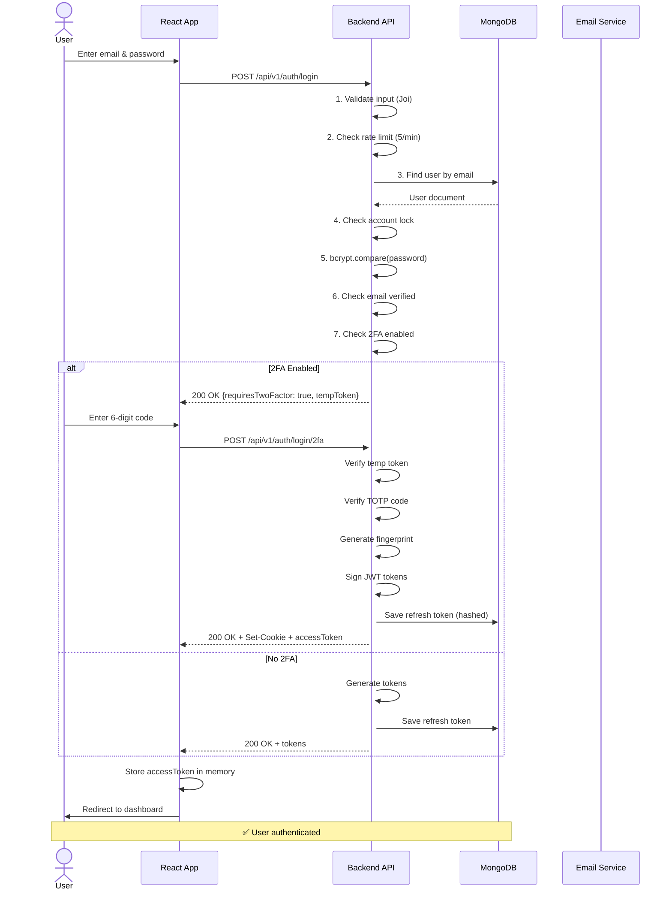
```mermaid
sequenceDiagram
    actor User
    participant Client as React App
    participant API as Backend API
    participant DB as MongoDB
    participant Email as Email Service

    User->>Client: Enter email & password
    Client->>API: POST /api/v1/auth/login
    
    activate API
    API->>API: 1. Validate input (Joi)
    API->>API: 2. Check rate limit (5/min)
    API->>DB: 3. Find user by email
    DB-->>API: User document
    API->>API: 4. Check account lock
    API->>API: 5. bcrypt.compare(password)
    API->>API: 6. Check email verified
    API->>API: 7. Check 2FA enabled
    
    alt 2FA Enabled
        API-->>Client: 200 OK {requiresTwoFactor: true, tempToken}
        
        User->>Client: Enter 6-digit code
        Client->>API: POST /api/v1/auth/login/2fa
        
        activate API
        API->>API: Verify temp token
        API->>API: Verify TOTP code
        API->>API: Generate fingerprint
        API->>API: Sign JWT tokens
        API->>DB: Save refresh token (hashed)
        API-->>Client: 200 OK + Set-Cookie + accessToken
    else No 2FA
        API->>API: Generate tokens
        API->>DB: Save refresh token
        API-->>Client: 200 OK + tokens
    end
    
    Client->>Client: Store accessToken in memory
    Client->>User: Redirect to dashboard

    Note over User,DB: ✅ User authenticated
```

---

## 🌐 3. OAUTH2 LOGIN FLOW (GitHub Example)

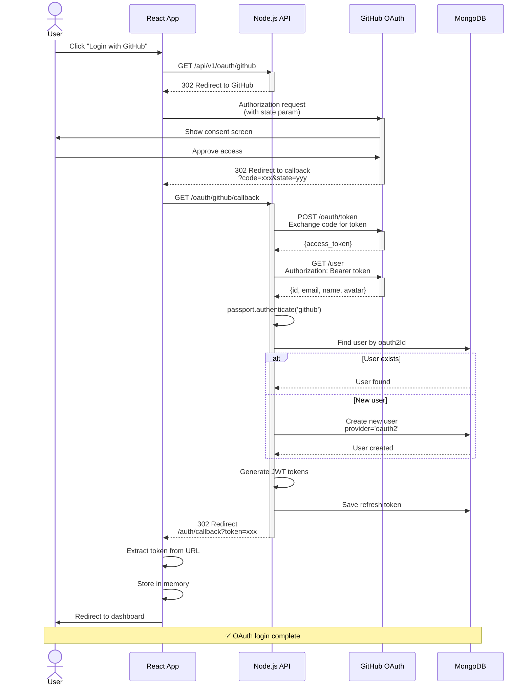
```mermaid
sequenceDiagram
    actor User
    participant Client as React App
    participant Backend as Node.js API
    participant GitHub as GitHub OAuth
    participant DB as MongoDB

    User->>Client: Click "Login with GitHub"
    Client->>Backend: GET /api/v1/oauth/github
    
    activate Backend
    Backend-->>Client: 302 Redirect to GitHub
    deactivate Backend
    
    Client->>GitHub: Authorization request<br/>(with state param)
    
    activate GitHub
    GitHub->>User: Show consent screen
    User->>GitHub: Approve access
    GitHub-->>Client: 302 Redirect to callback<br/>?code=xxx&state=yyy
    deactivate GitHub
    
    Client->>Backend: GET /oauth/github/callback
    
    activate Backend
    Backend->>GitHub: POST /oauth/token<br/>Exchange code for token
    activate GitHub
    GitHub-->>Backend: {access_token}
    deactivate GitHub
    
    Backend->>GitHub: GET /user<br/>Authorization: Bearer token
    activate GitHub
    GitHub-->>Backend: {id, email, name, avatar}
    deactivate GitHub
    
    Backend->>Backend: passport.authenticate('github')
    
    Backend->>DB: Find user by oauth2Id
    alt User exists
        DB-->>Backend: User found
    else New user
        Backend->>DB: Create new user<br/>provider='oauth2'
        DB-->>Backend: User created
    end
    
    Backend->>Backend: Generate JWT tokens
    Backend->>DB: Save refresh token
    Backend-->>Client: 302 Redirect<br/>/auth/callback?token=xxx
    deactivate Backend
    
    Client->>Client: Extract token from URL
    Client->>Client: Store in memory
    Client->>User: Redirect to dashboard

    Note over User,DB: ✅ OAuth login complete
```

---

## 🔄 4. JWT TOKEN REFRESH FLOW

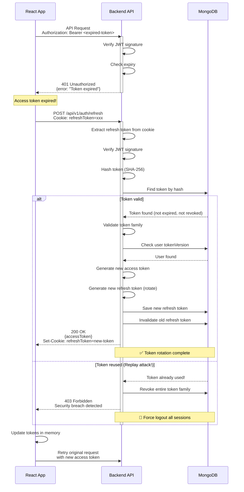
```mermaid
sequenceDiagram
    participant Client as React App
    participant API as Backend API
    participant DB as MongoDB

    Client->>API: API Request<br/>Authorization: Bearer <expired-token>
    
    activate API
    API->>API: Verify JWT signature
    API->>API: Check expiry
    API-->>Client: 401 Unauthorized<br/>{error: "Token expired"}
    deactivate API
    
    Note over Client: Access token expired!
    
    Client->>API: POST /api/v1/auth/refresh<br/>Cookie: refreshToken=xxx
    
    activate API
    API->>API: Extract refresh token from cookie
    API->>API: Verify JWT signature
    API->>API: Hash token (SHA-256)
    API->>DB: Find token by hash
    
    alt Token valid
        DB-->>API: Token found (not expired, not revoked)
        
        API->>API: Validate token family
        API->>DB: Check user tokenVersion
        DB-->>API: User found
        
        API->>API: Generate new access token
        API->>API: Generate new refresh token (rotate)
        
        API->>DB: Save new refresh token
        API->>DB: Invalidate old refresh token
        
        API-->>Client: 200 OK<br/>{accessToken}<br/>Set-Cookie: refreshToken=new-token
        
        Note over API,DB: ✅ Token rotation complete
    else Token reused (Replay attack!)
        DB-->>API: Token already used!
        
        API->>DB: Revoke entire token family
        API-->>Client: 403 Forbidden<br/>Security breach detected
        
        Note over API,DB: 🚨 Force logout all sessions
    end
    deactivate API
    
    Client->>Client: Update tokens in memory
    Client->>API: Retry original request<br/>with new access token
```

---

## 💳 5. STRIPE PAYMENT FLOW

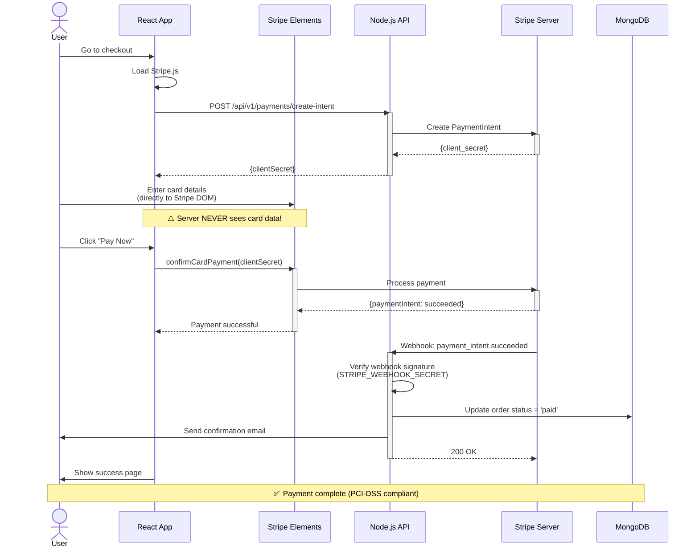
```mermaid
sequenceDiagram
    actor User
    participant Client as React App
    participant Stripe.js as Stripe Elements
    participant Backend as Node.js API
    participant StripeAPI as Stripe Server
    participant DB as MongoDB

    User->>Client: Go to checkout
    Client->>Client: Load Stripe.js
    
    Client->>Backend: POST /api/v1/payments/create-intent
    activate Backend
    Backend->>StripeAPI: Create PaymentIntent
    activate StripeAPI
    StripeAPI-->>Backend: {client_secret}
    deactivate StripeAPI
    Backend-->>Client: {clientSecret}
    deactivate Backend
    
    User->>Stripe.js: Enter card details<br/>(directly to Stripe DOM)
    
    Note over Client,Stripe.js: ⚠️ Server NEVER sees card data!
    
    User->>Client: Click "Pay Now"
    Client->>Stripe.js: confirmCardPayment(clientSecret)
    
    activate Stripe.js
    Stripe.js->>StripeAPI: Process payment
    activate StripeAPI
    StripeAPI-->>Stripe.js: {paymentIntent: succeeded}
    deactivate StripeAPI
    Stripe.js-->>Client: Payment successful
    deactivate Stripe.js
    
    StripeAPI->>Backend: Webhook: payment_intent.succeeded
    activate Backend
    Backend->>Backend: Verify webhook signature<br/>(STRIPE_WEBHOOK_SECRET)
    Backend->>DB: Update order status = 'paid'
    Backend->>User: Send confirmation email
    Backend-->>StripeAPI: 200 OK
    deactivate Backend
    
    Client->>User: Show success page

    Note over User,DB: ✅ Payment complete (PCI-DSS compliant)
```

---

## 🛡️ 6. SECURITY LAYERS (Defense in Depth)


```mermaid
graph TD
    subgraph L1["Layer 1: Network & Infrastructure"]
        HTTPS[HTTPS/TLS<br/>SSL Certificates]
        Nginx[Nginx Reverse Proxy]
        Docker[Docker Network Isolation]
        Firewall[UFW Firewall Rules]
    end

    subgraph L2["Layer 2: Application Security"]
        CORS[CORS Policy<br/>Origin Whitelist]
        CSP[Content Security Policy]
        RateLimit[Rate Limiting<br/>3 tiers]
        Helmet[Helmet Headers<br/>X-Frame, X-XSS]
        Cookies[Secure Cookies<br/>HttpOnly, SameSite]
    end

    subgraph L3["Layer 3: Input Validation"]
        Joi[Joi Schema Validation]
        Sanitize[MongoDB Sanitization]
        HPP[HPP Protection]
        PasswordPolicy[Password Policy<br/>12+ chars]
        FileValidation[File Upload Validation]
    end

    subgraph L4["Layer 4: Authentication"]
        JWT[JWT + Fingerprinting]
        TokenVersion[Token Versioning]
        Rotation[Refresh Token Rotation]
        TwoFA[2FA TOTP]
        OAuth[OAuth2 Integration]
        AccountLock[Account Lockout<br/>5 attempts]
    end

    subgraph L5["Layer 5: Authorization"]
        RBAC[Role-Based Access Control]
        EmailVerify[Email Verification Required]
        Ownership[Resource Ownership Check]
        AdminOnly[Admin-only Routes]
    end

    subgraph L6["Layer 6: Data Protection"]
        AES[AES-256-GCM Encryption]
        bcrypt[bcrypt Password Hashing<br/>12 rounds]
        SHA256[SHA-256 Token Hashing]
        FieldEncryption[Field-level Encryption]
    end

    subgraph L7["Layer 7: Monitoring & Response"]
        AuditLog[Audit Logging<br/>All auth events]
        Prometheus[Prometheus Metrics]
        EmailAlerts[Email Alerts<br/>Suspicious activity]
        AdminDash[Admin Audit Dashboard]
    end

    L1 --> L2
    L2 --> L3
    L3 --> L4
    L4 --> L5
    L5 --> L6
    L6 --> L7

    classDef layer1 fill:#E74C3C,stroke:#C0392B,stroke-width:3px,color:#fff
    classDef layer2 fill:#E67E22,stroke:#D35400,stroke-width:3px,color:#fff
    classDef layer3 fill:#F39C12,stroke:#D68910,stroke-width:3px,color:#fff
    classDef layer4 fill:#2ECC71,stroke:#27AE60,stroke-width:3px,color:#fff
    classDef layer5 fill:#3498DB,stroke:#2980B9,stroke-width:3px,color:#fff
    classDef layer6 fill:#9B59B6,stroke:#8E44AD,stroke-width:3px,color:#fff
    classDef layer7 fill:#1ABC9C,stroke:#16A085,stroke-width:3px,color:#fff

    class HTTPS,Nginx,Docker,Firewall layer1
    class CORS,CSP,RateLimit,Helmet,Cookies layer2
    class Joi,Sanitize,HPP,PasswordPolicy,FileValidation layer3
    class JWT,TokenVersion,Rotation,TwoFA,OAuth,AccountLock layer4
    class RBAC,EmailVerify,Ownership,AdminOnly layer5
    class AES,bcrypt,SHA256,FieldEncryption layer6
    class AuditLog,Prometheus,EmailAlerts,AdminDash layer7
```

---

## 🚨 7. THREAT MODEL & MITIGATIONS

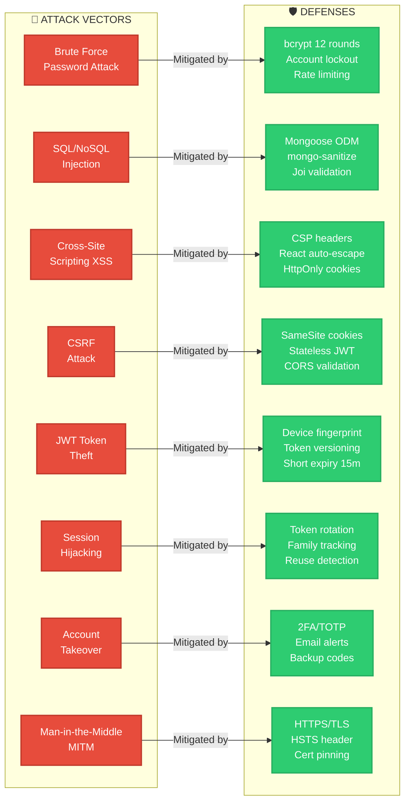
```mermaid
graph LR
    subgraph Threats["🎯 ATTACK VECTORS"]
        A1[Brute Force<br/>Password Attack]
        A2[SQL/NoSQL<br/>Injection]
        A3[Cross-Site<br/>Scripting XSS]
        A4[CSRF<br/>Attack]
        A5[JWT Token<br/>Theft]
        A6[Session<br/>Hijacking]
        A7[Account<br/>Takeover]
        A8[Man-in-the-Middle<br/>MITM]
    end

    subgraph Mitigations["🛡️ DEFENSES"]
        M1[bcrypt 12 rounds<br/>Account lockout<br/>Rate limiting]
        M2[Mongoose ODM<br/>mongo-sanitize<br/>Joi validation]
        M3[CSP headers<br/>React auto-escape<br/>HttpOnly cookies]
        M4[SameSite cookies<br/>Stateless JWT<br/>CORS validation]
        M5[Device fingerprint<br/>Token versioning<br/>Short expiry 15m]
        M6[Token rotation<br/>Family tracking<br/>Reuse detection]
        M7[2FA/TOTP<br/>Email alerts<br/>Backup codes]
        M8[HTTPS/TLS<br/>HSTS header<br/>Cert pinning]
    end

    A1 -->|Mitigated by| M1
    A2 -->|Mitigated by| M2
    A3 -->|Mitigated by| M3
    A4 -->|Mitigated by| M4
    A5 -->|Mitigated by| M5
    A6 -->|Mitigated by| M6
    A7 -->|Mitigated by| M7
    A8 -->|Mitigated by| M8

    classDef threat fill:#E74C3C,stroke:#C0392B,stroke-width:2px,color:#fff
    classDef defense fill:#2ECC71,stroke:#27AE60,stroke-width:2px,color:#fff

    class A1,A2,A3,A4,A5,A6,A7,A8 threat
    class M1,M2,M3,M4,M5,M6,M7,M8 defense
```

---

## 🔑 8. ENCRYPTION KEY HIERARCHY

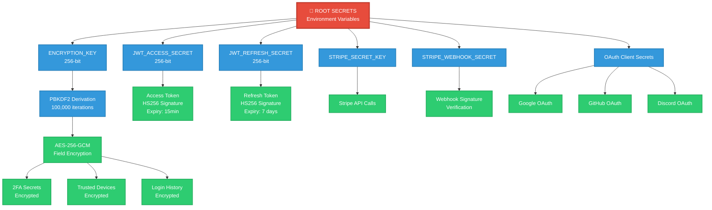
```mermaid
graph TD
    Root[🔐 ROOT SECRETS<br/>Environment Variables]
    
    Root --> ENC[ENCRYPTION_KEY<br/>256-bit]
    Root --> JWT_ACCESS[JWT_ACCESS_SECRET<br/>256-bit]
    Root --> JWT_REFRESH[JWT_REFRESH_SECRET<br/>256-bit]
    Root --> STRIPE_KEY[STRIPE_SECRET_KEY]
    Root --> WEBHOOK[STRIPE_WEBHOOK_SECRET]
    Root --> OAUTH[OAuth Client Secrets]

    ENC --> PBKDF2[PBKDF2 Derivation<br/>100,000 iterations]
    PBKDF2 --> AES[AES-256-GCM<br/>Field Encryption]
    
    AES --> TwoFA[2FA Secrets<br/>Encrypted]
    AES --> Devices[Trusted Devices<br/>Encrypted]
    AES --> History[Login History<br/>Encrypted]

    JWT_ACCESS --> Access[Access Token<br/>HS256 Signature<br/>Expiry: 15min]
    JWT_REFRESH --> Refresh[Refresh Token<br/>HS256 Signature<br/>Expiry: 7 days]

    STRIPE_KEY --> StripeAPI[Stripe API Calls]
    WEBHOOK --> WebhookVerify[Webhook Signature<br/>Verification]

    OAUTH --> Google[Google OAuth]
    OAUTH --> GitHub[GitHub OAuth]
    OAUTH --> Discord[Discord OAuth]

    classDef root fill:#E74C3C,stroke:#C0392B,stroke-width:3px,color:#fff
    classDef derived fill:#3498DB,stroke:#2980B9,stroke-width:2px,color:#fff
    classDef usage fill:#2ECC71,stroke:#27AE60,stroke-width:2px,color:#fff

    class Root root
    class ENC,JWT_ACCESS,JWT_REFRESH,STRIPE_KEY,WEBHOOK,OAUTH,PBKDF2 derived
    class AES,TwoFA,Devices,History,Access,Refresh,StripeAPI,WebhookVerify,Google,GitHub,Discord usage
```

---

## 📊 9. DATA LIFECYCLE

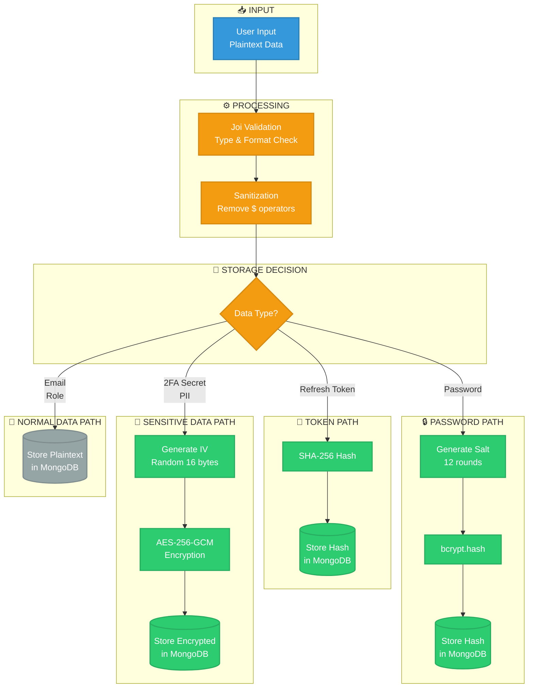
```mermaid
graph TB
    subgraph Input["📥 INPUT"]
        Plain[User Input<br/>Plaintext Data]
    end

    subgraph Processing["⚙️ PROCESSING"]
        Validate[Joi Validation<br/>Type & Format Check]
        Sanitize[Sanitization<br/>Remove $ operators]
    end

    subgraph Storage["💾 STORAGE DECISION"]
        Decision{Data Type?}
    end

    subgraph Password["🔒 PASSWORD PATH"]
        Salt[Generate Salt<br/>12 rounds]
        Hash[bcrypt.hash]
        StoreHash[(Store Hash<br/>in MongoDB)]
    end

    subgraph Token["🎫 TOKEN PATH"]
        SHA[SHA-256 Hash]
        StoreToken[(Store Hash<br/>in MongoDB)]
    end

    subgraph Sensitive["🔐 SENSITIVE DATA PATH"]
        IV[Generate IV<br/>Random 16 bytes]
        Encrypt[AES-256-GCM<br/>Encryption]
        StoreCipher[(Store Encrypted<br/>in MongoDB)]
    end

    subgraph Normal["📝 NORMAL DATA PATH"]
        StoreNormal[(Store Plaintext<br/>in MongoDB)]
    end

    Plain --> Validate
    Validate --> Sanitize
    Sanitize --> Decision

    Decision -->|Password| Salt
    Salt --> Hash
    Hash --> StoreHash

    Decision -->|Refresh Token| SHA
    SHA --> StoreToken

    Decision -->|2FA Secret<br/>PII| IV
    IV --> Encrypt
    Encrypt --> StoreCipher

    Decision -->|Email<br/>Role| StoreNormal

    classDef input fill:#3498DB,stroke:#2980B9,stroke-width:2px,color:#fff
    classDef process fill:#F39C12,stroke:#D68910,stroke-width:2px,color:#fff
    classDef secure fill:#2ECC71,stroke:#27AE60,stroke-width:2px,color:#fff
    classDef normal fill:#95A5A6,stroke:#7F8C8D,stroke-width:2px,color:#fff

    class Plain input
    class Validate,Sanitize,Decision process
    class Salt,Hash,StoreHash,SHA,StoreToken,IV,Encrypt,StoreCipher secure
    class StoreNormal normal
```

---

## 🚨 10. INCIDENT RESPONSE FLOW

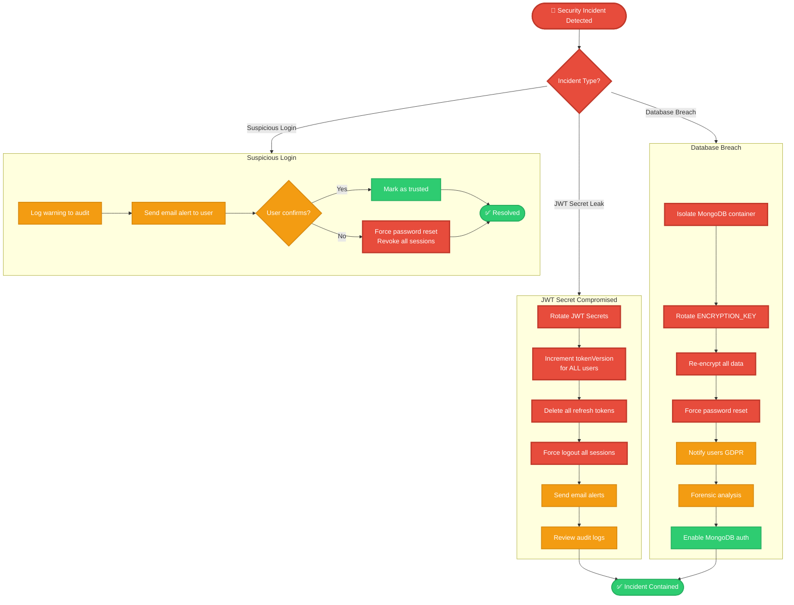
```mermaid
flowchart TD
    Start([🚨 Security Incident Detected])
    
    Start --> Detect{Incident Type?}
    
    Detect -->|JWT Secret Leak| JWT_Flow
    Detect -->|Database Breach| DB_Flow
    Detect -->|Suspicious Login| Login_Flow
    
    subgraph JWT_Flow["JWT Secret Compromised"]
        JWT1[Rotate JWT Secrets]
        JWT2[Increment tokenVersion<br/>for ALL users]
        JWT3[Delete all refresh tokens]
        JWT4[Force logout all sessions]
        JWT5[Send email alerts]
        JWT6[Review audit logs]
        
        JWT1 --> JWT2 --> JWT3 --> JWT4 --> JWT5 --> JWT6
    end
    
    subgraph DB_Flow["Database Breach"]
        DB1[Isolate MongoDB container]
        DB2[Rotate ENCRYPTION_KEY]
        DB3[Re-encrypt all data]
        DB4[Force password reset]
        DB5[Notify users GDPR]
        DB6[Forensic analysis]
        DB7[Enable MongoDB auth]
        
        DB1 --> DB2 --> DB3 --> DB4 --> DB5 --> DB6 --> DB7
    end
    
    subgraph Login_Flow["Suspicious Login"]
        L1[Log warning to audit]
        L2[Send email alert to user]
        L3{User confirms?}
        L3 -->|Yes| L4[Mark as trusted]
        L3 -->|No| L5[Force password reset<br/>Revoke all sessions]
        
        L1 --> L2 --> L3
        L4 --> End1([✅ Resolved])
        L5 --> End1
    end
    
    JWT6 --> End2([✅ Incident Contained])
    DB7 --> End2
    
    classDef critical fill:#E74C3C,stroke:#C0392B,stroke-width:3px,color:#fff
    classDef warning fill:#F39C12,stroke:#D68910,stroke-width:2px,color:#fff
    classDef safe fill:#2ECC71,stroke:#27AE60,stroke-width:2px,color:#fff
    
    class Start,Detect critical
    class JWT1,JWT2,JWT3,JWT4,DB1,DB2,DB3,DB4,L5 critical
    class JWT5,JWT6,DB5,DB6,L1,L2,L3 warning
    class DB7,L4,End1,End2 safe
```

---

## 📈 11. MONITORING METRICS DASHBOARD

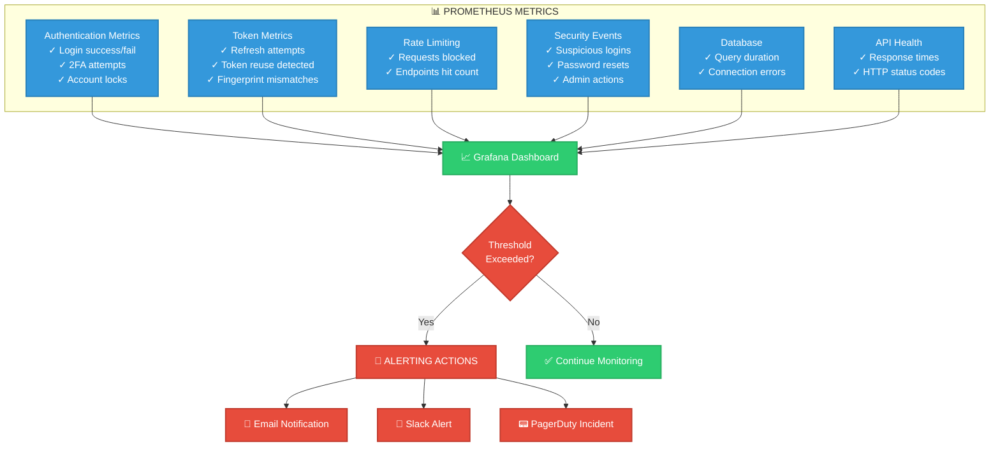
```mermaid
graph TB
    subgraph Prometheus["📊 PROMETHEUS METRICS"]
        direction TB
        
        Auth[Authentication Metrics<br/>✓ Login success/fail<br/>✓ 2FA attempts<br/>✓ Account locks]
        
        Token[Token Metrics<br/>✓ Refresh attempts<br/>✓ Token reuse detected<br/>✓ Fingerprint mismatches]
        
        Rate[Rate Limiting<br/>✓ Requests blocked<br/>✓ Endpoints hit count]
        
        Security[Security Events<br/>✓ Suspicious logins<br/>✓ Password resets<br/>✓ Admin actions]
        
        DB[Database<br/>✓ Query duration<br/>✓ Connection errors]
        
        API[API Health<br/>✓ Response times<br/>✓ HTTP status codes]
    end
    
    Auth --> Grafana[📈 Grafana Dashboard]
    Token --> Grafana
    Rate --> Grafana
    Security --> Grafana
    DB --> Grafana
    API --> Grafana
    
    Grafana --> Alert{Threshold<br/>Exceeded?}
    
    Alert -->|Yes| Actions[🚨 ALERTING ACTIONS]
    Alert -->|No| Monitor[✅ Continue Monitoring]
    
    Actions --> Email[📧 Email Notification]
    Actions --> Slack[💬 Slack Alert]
    Actions --> PagerDuty[📟 PagerDuty Incident]
    
    classDef metrics fill:#3498DB,stroke:#2980B9,stroke-width:2px,color:#fff
    classDef dashboard fill:#2ECC71,stroke:#27AE60,stroke-width:2px,color:#fff
    classDef alert fill:#E74C3C,stroke:#C0392B,stroke-width:2px,color:#fff
    
    class Auth,Token,Rate,Security,DB,API metrics
    class Grafana,Monitor dashboard
    class Alert,Actions,Email,Slack,PagerDuty alert
```

---

## ✅ HOW TO USE THESE DIAGRAMS

### **In VSCode:**
1. Install extension: `Markdown Preview Mermaid Support`
2. Open this file
3. Press `Ctrl+Shift+V` (Windows) or `Cmd+Shift+V` (Mac)
4. See live preview with rendered diagrams!

### **On GitHub/GitLab:**
- Just push this file → diagrams auto-render ✨

### **Export to PNG/PDF:**
```bash
# Using Mermaid CLI
npm install -g @mermaid-js/mermaid-cli
mmdc -i docs/diagrams-mermaid.md -o docs/diagrams.pdf
```

### **For Presentations:**
- Right-click diagram in preview → "Save as PNG"
- Or use Draw.io version (see `security-architecture.drawio`)

---

---

## 🔄 12. TOKEN LIFECYCLE & ROTATION

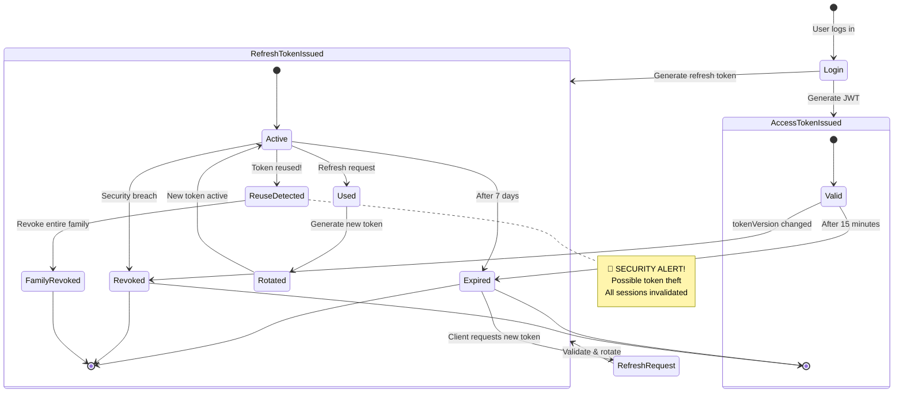
```mermaid
stateDiagram-v2
    [*] --> Login: User logs in
    
    Login --> AccessTokenIssued: Generate JWT
    Login --> RefreshTokenIssued: Generate refresh token
    
    state AccessTokenIssued {
        [*] --> Valid
        Valid --> Expired: After 15 minutes
        Valid --> Revoked: tokenVersion changed
        Expired --> [*]
        Revoked --> [*]
    }
    
    state RefreshTokenIssued {
        [*] --> Active
        Active --> Used: Refresh request
        Used --> Rotated: Generate new token
        Rotated --> Active: New token active
        Active --> Expired: After 7 days
        Active --> Revoked: Security breach
        Active --> ReuseDetected: Token reused!
        ReuseDetected --> FamilyRevoked: Revoke entire family
        Expired --> [*]
        Revoked --> [*]
        FamilyRevoked --> [*]
    }
    
    Expired --> RefreshRequest: Client requests new token
    RefreshRequest --> RefreshTokenIssued: Validate & rotate
    
    note right of ReuseDetected
        🚨 SECURITY ALERT!
        Possible token theft
        All sessions invalidated
    end note
```

---

## 🔐 13. PASSWORD SECURITY FLOW

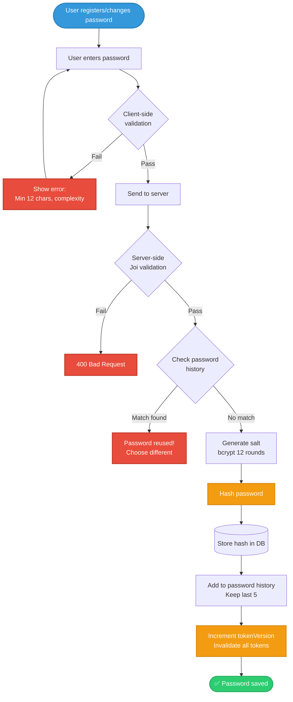
```mermaid
flowchart TD
    Start([User registers/changes password])
    
    Start --> Input[User enters password]
    Input --> ClientValidate{Client-side<br/>validation}
    
    ClientValidate -->|Fail| Error1[Show error:<br/>Min 12 chars, complexity]
    Error1 --> Input
    
    ClientValidate -->|Pass| Server[Send to server]
    Server --> ServerValidate{Server-side<br/>Joi validation}
    
    ServerValidate -->|Fail| Error2[400 Bad Request]
    
    ServerValidate -->|Pass| CheckHistory{Check password<br/>history}
    CheckHistory -->|Match found| Error3[Password reused!<br/>Choose different]
    
    CheckHistory -->|No match| Generate[Generate salt<br/>bcrypt 12 rounds]
    Generate --> Hash[Hash password]
    Hash --> Store[(Store hash in DB)]
    
    Store --> UpdateHistory[Add to password history<br/>Keep last 5]
    UpdateHistory --> InvalidateTokens[Increment tokenVersion<br/>Invalidate all tokens]
    
    InvalidateTokens --> Success([✅ Password saved])
    
    style Start fill:#3498DB,stroke:#2980B9,stroke-width:2px,color:#fff
    style Success fill:#2ECC71,stroke:#27AE60,stroke-width:2px,color:#fff
    style Error1 fill:#E74C3C,stroke:#C0392B,stroke-width:2px,color:#fff
    style Error2 fill:#E74C3C,stroke:#C0392B,stroke-width:2px,color:#fff
    style Error3 fill:#E74C3C,stroke:#C0392B,stroke-width:2px,color:#fff
    style Hash fill:#F39C12,stroke:#D68910,stroke-width:2px,color:#fff
    style InvalidateTokens fill:#F39C12,stroke:#D68910,stroke-width:2px,color:#fff
```

---

## 📧 14. EMAIL VERIFICATION FLOW

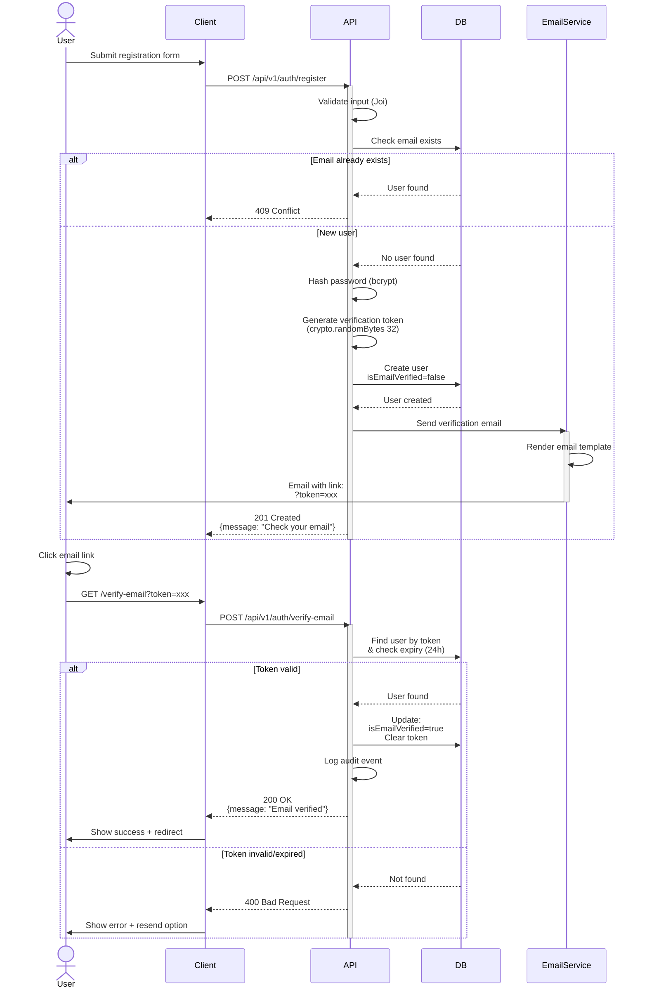
```mermaid
sequenceDiagram
    actor User
    participant Client
    participant API
    participant DB
    participant EmailService

    User->>Client: Submit registration form
    Client->>API: POST /api/v1/auth/register
    
    activate API
    API->>API: Validate input (Joi)
    API->>DB: Check email exists
    alt Email already exists
        DB-->>API: User found
        API-->>Client: 409 Conflict
    else New user
        DB-->>API: No user found
        API->>API: Hash password (bcrypt)
        API->>API: Generate verification token<br/>(crypto.randomBytes 32)
        API->>DB: Create user<br/>isEmailVerified=false
        DB-->>API: User created
        
        API->>EmailService: Send verification email
        activate EmailService
        EmailService->>EmailService: Render email template
        EmailService->>User: Email with link:<br/>?token=xxx
        deactivate EmailService
        
        API-->>Client: 201 Created<br/>{message: "Check your email"}
    end
    deactivate API
    
    User->>User: Click email link
    User->>Client: GET /verify-email?token=xxx
    Client->>API: POST /api/v1/auth/verify-email
    
    activate API
    API->>DB: Find user by token<br/>& check expiry (24h)
    alt Token valid
        DB-->>API: User found
        API->>DB: Update:<br/>isEmailVerified=true<br/>Clear token
        API->>API: Log audit event
        API-->>Client: 200 OK<br/>{message: "Email verified"}
        Client->>User: Show success + redirect
    else Token invalid/expired
        DB-->>API: Not found
        API-->>Client: 400 Bad Request
        Client->>User: Show error + resend option
    end
    deactivate API
```

---

## 🔑 15. TWO-FACTOR AUTHENTICATION (2FA) SETUP

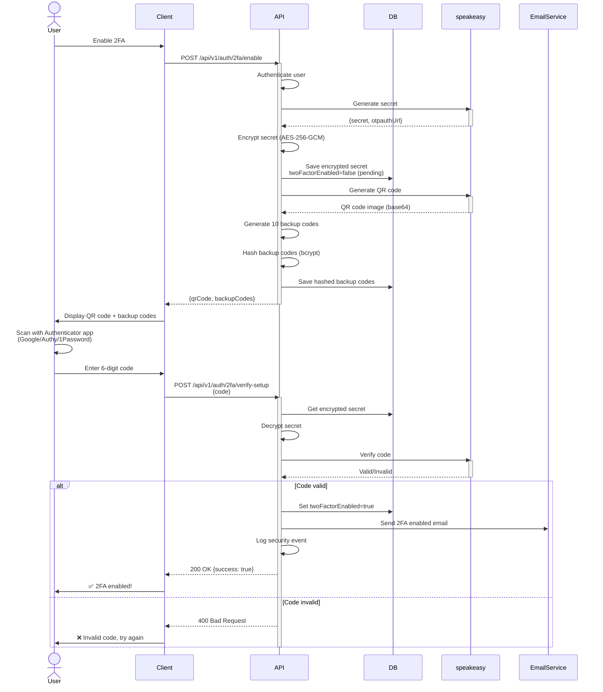
```mermaid
sequenceDiagram
    actor User
    participant Client
    participant API
    participant DB
    participant TOTPLib as speakeasy

    User->>Client: Enable 2FA
    Client->>API: POST /api/v1/auth/2fa/enable
    
    activate API
    API->>API: Authenticate user
    API->>TOTPLib: Generate secret
    activate TOTPLib
    TOTPLib-->>API: {secret, otpauthUrl}
    deactivate TOTPLib
    
    API->>API: Encrypt secret (AES-256-GCM)
    API->>DB: Save encrypted secret<br/>twoFactorEnabled=false (pending)
    
    API->>TOTPLib: Generate QR code
    activate TOTPLib
    TOTPLib-->>API: QR code image (base64)
    deactivate TOTPLib
    
    API->>API: Generate 10 backup codes
    API->>API: Hash backup codes (bcrypt)
    API->>DB: Save hashed backup codes
    
    API-->>Client: {qrCode, backupCodes}
    deactivate API
    
    Client->>User: Display QR code + backup codes
    User->>User: Scan with Authenticator app<br/>(Google/Authy/1Password)
    
    User->>Client: Enter 6-digit code
    Client->>API: POST /api/v1/auth/2fa/verify-setup<br/>{code}
    
    activate API
    API->>DB: Get encrypted secret
    API->>API: Decrypt secret
    API->>TOTPLib: Verify code
    activate TOTPLib
    TOTPLib-->>API: Valid/Invalid
    deactivate TOTPLib
    
    alt Code valid
        API->>DB: Set twoFactorEnabled=true
        API->>EmailService: Send 2FA enabled email
        API->>API: Log security event
        API-->>Client: 200 OK {success: true}
        Client->>User: ✅ 2FA enabled!
    else Code invalid
        API-->>Client: 400 Bad Request
        Client->>User: ❌ Invalid code, try again
    end
    deactivate API
```

---

## 💰 16. PAYMENT PROCESSING (Stripe) - DETAILED

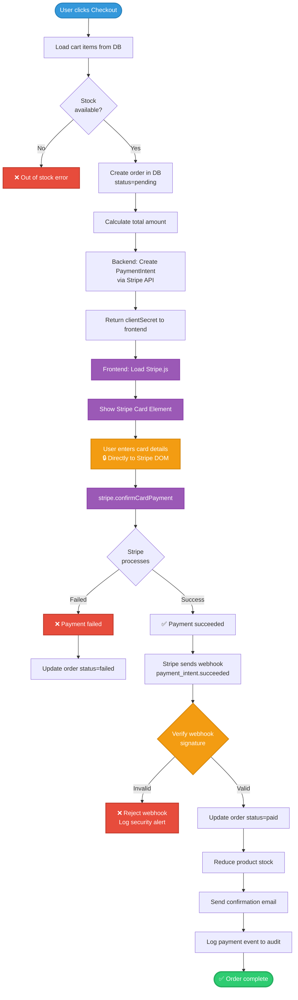
```mermaid
flowchart TD
    Start([User clicks Checkout])
    
    Start --> LoadCart[Load cart items from DB]
    LoadCart --> ValidateStock{Stock<br/>available?}
    
    ValidateStock -->|No| OutOfStock[❌ Out of stock error]
    
    ValidateStock -->|Yes| CreateOrder[Create order in DB<br/>status=pending]
    CreateOrder --> CalcAmount[Calculate total amount]
    
    CalcAmount --> CreateIntent[Backend: Create PaymentIntent<br/>via Stripe API]
    CreateIntent --> ClientSecret[Return clientSecret to frontend]
    
    ClientSecret --> LoadStripe[Frontend: Load Stripe.js]
    LoadStripe --> ShowCard[Show Stripe Card Element]
    
    ShowCard --> UserEnter[User enters card details<br/>🔒 Directly to Stripe DOM]
    
    UserEnter --> ConfirmPayment[stripe.confirmCardPayment]
    ConfirmPayment --> StripeProcess{Stripe<br/>processes}
    
    StripeProcess -->|Failed| PaymentFailed[❌ Payment failed]
    PaymentFailed --> UpdateOrderFail[Update order status=failed]
    
    StripeProcess -->|Success| PaymentSuccess[✅ Payment succeeded]
    PaymentSuccess --> StripeWebhook[Stripe sends webhook<br/>payment_intent.succeeded]
    
    StripeWebhook --> VerifySignature{Verify webhook<br/>signature}
    
    VerifySignature -->|Invalid| RejectWebhook[❌ Reject webhook<br/>Log security alert]
    
    VerifySignature -->|Valid| UpdateOrderSuccess[Update order status=paid]
    UpdateOrderSuccess --> ReduceStock[Reduce product stock]
    ReduceStock --> SendEmail[Send confirmation email]
    SendEmail --> LogAudit[Log payment event to audit]
    LogAudit --> Complete([✅ Order complete])
    
    style Start fill:#3498DB,stroke:#2980B9,stroke-width:2px,color:#fff
    style UserEnter fill:#F39C12,stroke:#D68910,stroke-width:2px,color:#fff
    style VerifySignature fill:#F39C12,stroke:#D68910,stroke-width:2px,color:#fff
    style Complete fill:#2ECC71,stroke:#27AE60,stroke-width:3px,color:#fff
    style PaymentFailed fill:#E74C3C,stroke:#C0392B,stroke-width:2px,color:#fff
    style OutOfStock fill:#E74C3C,stroke:#C0392B,stroke-width:2px,color:#fff
    style RejectWebhook fill:#E74C3C,stroke:#C0392B,stroke-width:2px,color:#fff
    
    classDef pciCompliant fill:#9B59B6,stroke:#8E44AD,stroke-width:2px,color:#fff
    class LoadStripe,ShowCard,UserEnter,ConfirmPayment pciCompliant
```

---

## 🛡️ 17. ATTACK SCENARIOS & MITIGATIONS

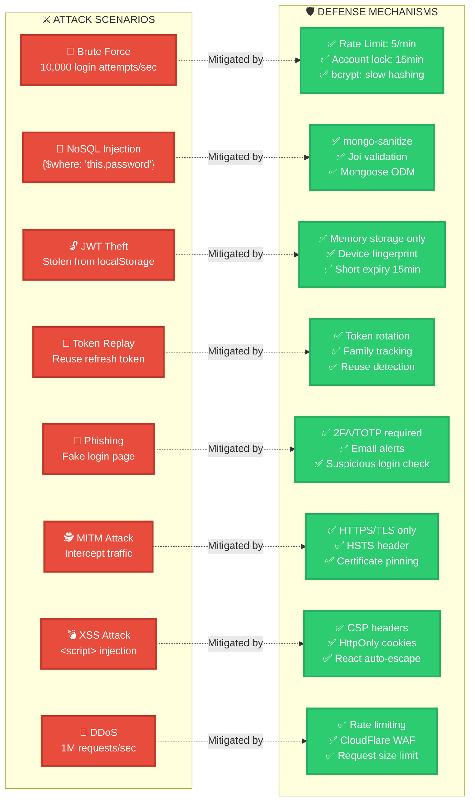
```mermaid
graph LR
    subgraph Attacks["⚔️ ATTACK SCENARIOS"]
        A1["🎯 Brute Force<br/>10,000 login attempts/sec"]
        A2["💉 NoSQL Injection<br/>{$where: 'this.password'}"]
        A3["🔓 JWT Theft<br/>Stolen from localStorage"]
        A4["🔄 Token Replay<br/>Reuse refresh token"]
        A5["📧 Phishing<br/>Fake login page"]
        A6["🕵️ MITM Attack<br/>Intercept traffic"]
        A7["💣 XSS Attack<br/>&lt;script&gt; injection"]
        A8["🌊 DDoS<br/>1M requests/sec"]
    end
    
    subgraph Mitigations["🛡️ DEFENSE MECHANISMS"]
        M1["✅ Rate Limit: 5/min<br/>✅ Account lock: 15min<br/>✅ bcrypt: slow hashing"]
        
        M2["✅ mongo-sanitize<br/>✅ Joi validation<br/>✅ Mongoose ODM"]
        
        M3["✅ Memory storage only<br/>✅ Device fingerprint<br/>✅ Short expiry 15min"]
        
        M4["✅ Token rotation<br/>✅ Family tracking<br/>✅ Reuse detection"]
        
        M5["✅ 2FA/TOTP required<br/>✅ Email alerts<br/>✅ Suspicious login check"]
        
        M6["✅ HTTPS/TLS only<br/>✅ HSTS header<br/>✅ Certificate pinning"]
        
        M7["✅ CSP headers<br/>✅ HttpOnly cookies<br/>✅ React auto-escape"]
        
        M8["✅ Rate limiting<br/>✅ CloudFlare WAF<br/>✅ Request size limit"]
    end
    
    A1 -.->|Mitigated by| M1
    A2 -.->|Mitigated by| M2
    A3 -.->|Mitigated by| M3
    A4 -.->|Mitigated by| M4
    A5 -.->|Mitigated by| M5
    A6 -.->|Mitigated by| M6
    A7 -.->|Mitigated by| M7
    A8 -.->|Mitigated by| M8
    
    style A1 fill:#E74C3C,stroke:#C0392B,stroke-width:3px,color:#fff
    style A2 fill:#E74C3C,stroke:#C0392B,stroke-width:3px,color:#fff
    style A3 fill:#E74C3C,stroke:#C0392B,stroke-width:3px,color:#fff
    style A4 fill:#E74C3C,stroke:#C0392B,stroke-width:3px,color:#fff
    style A5 fill:#E74C3C,stroke:#C0392B,stroke-width:3px,color:#fff
    style A6 fill:#E74C3C,stroke:#C0392B,stroke-width:3px,color:#fff
    style A7 fill:#E74C3C,stroke:#C0392B,stroke-width:3px,color:#fff
    style A8 fill:#E74C3C,stroke:#C0392B,stroke-width:3px,color:#fff
    
    style M1 fill:#2ECC71,stroke:#27AE60,stroke-width:3px,color:#fff
    style M2 fill:#2ECC71,stroke:#27AE60,stroke-width:3px,color:#fff
    style M3 fill:#2ECC71,stroke:#27AE60,stroke-width:3px,color:#fff
    style M4 fill:#2ECC71,stroke:#27AE60,stroke-width:3px,color:#fff
    style M5 fill:#2ECC71,stroke:#27AE60,stroke-width:3px,color:#fff
    style M6 fill:#2ECC71,stroke:#27AE60,stroke-width:3px,color:#fff
    style M7 fill:#2ECC71,stroke:#27AE60,stroke-width:3px,color:#fff
    style M8 fill:#2ECC71,stroke:#27AE60,stroke-width:3px,color:#fff
```

---

## 🗄️ 18. DATABASE SECURITY LAYERS

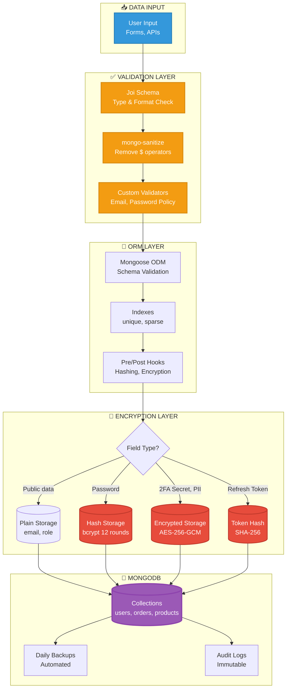
```mermaid
graph TB
    subgraph Input["📥 DATA INPUT"]
        UserData[User Input<br/>Forms, APIs]
    end
    
    subgraph Validation["✅ VALIDATION LAYER"]
        Joi[Joi Schema<br/>Type & Format Check]
        Sanitize[mongo-sanitize<br/>Remove $ operators]
        Custom[Custom Validators<br/>Email, Password Policy]
    end
    
    subgraph ORM["🔧 ORM LAYER"]
        Mongoose[Mongoose ODM<br/>Schema Validation]
        Indexes[Indexes<br/>unique, sparse]
        Hooks[Pre/Post Hooks<br/>Hashing, Encryption]
    end
    
    subgraph Encryption["🔐 ENCRYPTION LAYER"]
        Decision{Field Type?}
        
        PlainStore[(Plain Storage<br/>email, role)]
        HashStore[(Hash Storage<br/>bcrypt 12 rounds)]
        EncryptStore[(Encrypted Storage<br/>AES-256-GCM)]
        TokenStore[(Token Hash<br/>SHA-256)]
    end
    
    subgraph Database["💾 MONGODB"]
        Collections[(Collections<br/>users, orders, products)]
        Backup[Daily Backups<br/>Automated]
        Audit[Audit Logs<br/>Immutable]
    end
    
    UserData --> Joi
    Joi --> Sanitize
    Sanitize --> Custom
    Custom --> Mongoose
    Mongoose --> Indexes
    Indexes --> Hooks
    Hooks --> Decision
    
    Decision -->|Public data| PlainStore
    Decision -->|Password| HashStore
    Decision -->|2FA Secret, PII| EncryptStore
    Decision -->|Refresh Token| TokenStore
    
    PlainStore --> Collections
    HashStore --> Collections
    EncryptStore --> Collections
    TokenStore --> Collections
    
    Collections --> Backup
    Collections --> Audit
    
    style UserData fill:#3498DB,stroke:#2980B9,stroke-width:2px,color:#fff
    style Joi fill:#F39C12,stroke:#D68910,stroke-width:2px,color:#fff
    style Sanitize fill:#F39C12,stroke:#D68910,stroke-width:2px,color:#fff
    style Custom fill:#F39C12,stroke:#D68910,stroke-width:2px,color:#fff
    style HashStore fill:#E74C3C,stroke:#C0392B,stroke-width:2px,color:#fff
    style EncryptStore fill:#E74C3C,stroke:#C0392B,stroke-width:2px,color:#fff
    style TokenStore fill:#E74C3C,stroke:#C0392B,stroke-width:2px,color:#fff
    style Collections fill:#9B59B6,stroke:#8E44AD,stroke-width:3px,color:#fff
```

---

## 🔍 19. AUDIT LOG ARCHITECTURE

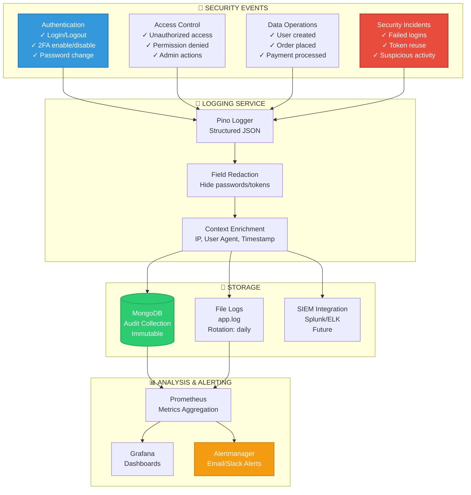
```mermaid
graph TB
    subgraph Events["📝 SECURITY EVENTS"]
        Auth[Authentication<br/>✓ Login/Logout<br/>✓ 2FA enable/disable<br/>✓ Password change]
        
        Access[Access Control<br/>✓ Unauthorized access<br/>✓ Permission denied<br/>✓ Admin actions]
        
        Data[Data Operations<br/>✓ User created<br/>✓ Order placed<br/>✓ Payment processed]
        
        Security[Security Incidents<br/>✓ Failed logins<br/>✓ Token reuse<br/>✓ Suspicious activity]
    end
    
    subgraph Logger["🔧 LOGGING SERVICE"]
        Pino[Pino Logger<br/>Structured JSON]
        Redact[Field Redaction<br/>Hide passwords/tokens]
        Enrich[Context Enrichment<br/>IP, User Agent, Timestamp]
    end
    
    subgraph Storage["💾 STORAGE"]
        MongoDB[(MongoDB<br/>Audit Collection<br/>Immutable)]
        
        FileLog[File Logs<br/>app.log<br/>Rotation: daily]
        
        SIEM[SIEM Integration<br/>Splunk/ELK<br/>Future]
    end
    
    subgraph Analysis["📊 ANALYSIS & ALERTING"]
        Prometheus[Prometheus<br/>Metrics Aggregation]
        Grafana[Grafana<br/>Dashboards]
        Alert[Alertmanager<br/>Email/Slack Alerts]
    end
    
    Auth --> Pino
    Access --> Pino
    Data --> Pino
    Security --> Pino
    
    Pino --> Redact
    Redact --> Enrich
    
    Enrich --> MongoDB
    Enrich --> FileLog
    Enrich --> SIEM
    
    MongoDB --> Prometheus
    FileLog --> Prometheus
    
    Prometheus --> Grafana
    Prometheus --> Alert
    
    style Auth fill:#3498DB,stroke:#2980B9,stroke-width:2px,color:#fff
    style Security fill:#E74C3C,stroke:#C0392B,stroke-width:2px,color:#fff
    style MongoDB fill:#2ECC71,stroke:#27AE60,stroke-width:2px,color:#fff
    style Alert fill:#F39C12,stroke:#D68910,stroke-width:2px,color:#fff
```

---

## 🚀 20. DEPLOYMENT PIPELINE


```mermaid
graph LR
    subgraph Dev["💻 DEVELOPMENT"]
        Code[Write Code<br/>VSCode]
        Test[Run Tests<br/>Jest]
        Lint[Linting<br/>ESLint]
    end
    
    subgraph CI["🔄 CI/CD"]
        Git[Git Push<br/>GitHub]
        Actions[GitHub Actions<br/>Automated Tests]
        Scan[Security Scan<br/>npm audit, Snyk]
    end
    
    subgraph Build["🏗️ BUILD"]
        Backend[Build Backend<br/>TypeScript → JS]
        Frontend[Build Frontend<br/>Vite Bundle]
        Docker[Build Docker Images<br/>Backend + Frontend]
    end
    
    subgraph Registry["📦 REGISTRY"]
        Hub[Docker Hub<br/>jackydev2006/nt219-*]
    end
    
    subgraph Deploy["🚀 DEPLOYMENT"]
        Pull[VPS: Pull Images]
        Compose[docker-compose up<br/>Production mode]
        Health[Health Check<br/>/health endpoint]
    end
    
    subgraph Monitor["📊 MONITORING"]
        Prom[Prometheus<br/>Scrape Metrics]
        Graf[Grafana<br/>Visualize]
        Alerts[Alert Rules<br/>Notify on issues]
    end
    
    Code --> Test
    Test --> Lint
    Lint --> Git
    
    Git --> Actions
    Actions --> Scan
    Scan -->|Pass| Backend
    Scan -->|Pass| Frontend
    
    Backend --> Docker
    Frontend --> Docker
    Docker --> Hub
    
    Hub --> Pull
    Pull --> Compose
    Compose --> Health
    
    Health -->|Success| Prom
    Health -->|Fail| Rollback[Rollback to<br/>Previous Version]
    
    Prom --> Graf
    Prom --> Alerts
    
    style Code fill:#3498DB,stroke:#2980B9,stroke-width:2px,color:#fff
    style Scan fill:#F39C12,stroke:#D68910,stroke-width:2px,color:#fff
    style Docker fill:#2ECC71,stroke:#27AE60,stroke-width:2px,color:#fff
    style Health fill:#F39C12,stroke:#D68910,stroke-width:2px,color:#fff
    style Rollback fill:#E74C3C,stroke:#C0392B,stroke-width:2px,color:#fff
```

---

## 📋 21. OWASP TOP 10 COVERAGE

```mermaid
mindmap
  root((OWASP Top 10<br/>2021))
    A01 Broken Access Control
      RBAC user/admin
      Email verification
      Resource ownership
      JWT authorization
    A02 Cryptographic Failures
      AES-256-GCM encryption
      bcrypt password hash
      TLS/HTTPS only
      Secure key storage
    A03 Injection
      Joi validation
      mongo-sanitize
      Parameterized queries
      Input sanitization
    A04 Insecure Design
      Threat modeling
      Defense in depth
      Security by default
      Principle of least privilege
    A05 Security Misconfiguration
      Helmet headers
      CSP policy
      No default passwords
      Error handling
    A06 Vulnerable Components
      npm audit
      Dependabot alerts
      Regular updates
      Version pinning
    A07 Auth Failures
      JWT + 2FA
      Token rotation
      Account lockout
      Session management
    A08 Software Integrity
      Docker image scan
      Code signing
      Integrity checks
      HTTPS verification
    A09 Logging Failures
      Audit logging
      Pino structured logs
      Prometheus metrics
      Security events
    A10 SSRF
      URL validation
      Whitelist APIs
      Network isolation
      Request filtering
```

---

**Generated:** November 12, 2025  
**Total Diagrams:** 21 comprehensive security diagrams  
**Project:** NT219 Secure E-Commerce Platform  
**Render Engine:** Mermaid.js v10+
